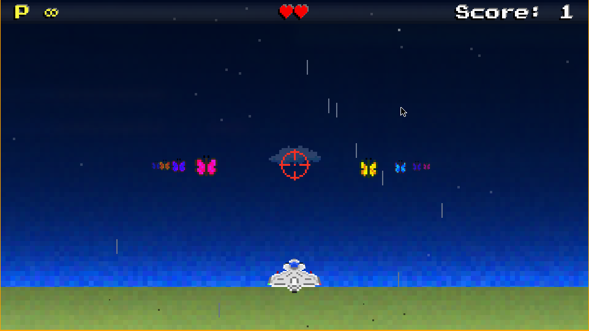

# BUTTERFLY DESTROYERS

A Game Project for the PyWeek29 game jam, built in one week by Team PythonixCoders!



## Team Members

- [flipcoder](https://github.com/flipcoder/)
- [ddorn](https://gitlab.com/ddorn/)
- [MysteryCoder456](https://github.com/MysteryCoder456/)
- [tamwile](https://github.com/tamwile/)
- [jtiai](https://github.com/jtiai/)

## How to Play

```
pip install -r requirements.txt
python ./run.py
```

Or in a virtual environement :

```shell script
git clone https://github.com/PythonixCoders/PyWeek29.git butterfly-destroyer
cd butterfly-destroyer
python -m venv .env
source .env/bin/activate
pip install -r requirements.txt
python run.py
```

The keyboard controls are simple : 
 - WASD or arrows to move
 - Space or enter to shoot
 - Shift to change weapons after unlock

But the game is better with a controler, 
however it was only tested with an Xbox controler
and there is no garanty that it will work with
correct mappings on others.
 - Main sticks to move
 - A/B or RB/LB to shoot
 - X/Y to change weapons after unlock

## Credits
Ship graphic: https://opengameart.org/users/pitrizzo

Font: https://www.dafont.com/press-start-2p.font
 